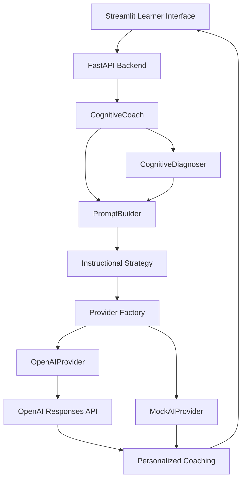

# 🧠 Problem Reframing Coach

An AI-powered cognitive coaching platform that helps learners improve **how they think**, not just **what they know**.

Rather than providing answers, the application guides learners through identifying hidden assumptions, reframing problems, and developing transferable thinking skills through structured AI coaching.

---

# Project Vision

Most AI applications are designed to answer questions.

This project explores a different question:

> **What if AI could help people become better thinkers instead of simply providing answers?**

Instead of replacing human reasoning, the goal is to strengthen it.

---

# The Problem

People frequently solve the problem they believe they have instead of the problem they actually have.

Examples include:

- Removing a television from its box so it fits in an elevator instead of using a crane.
- Deflating a truck's tires so it can pass under a bridge instead of dismantling the truck or lifting the bridge.

These examples demonstrate **functional fixedness**—the tendency to accept hidden assumptions without questioning them.

This application teaches learners to recognize those thinking patterns before committing to a solution.

---

# Learning Objectives

Learners practice:

- Questioning assumptions
- Problem reframing
- Challenging constraints
- Simplifying before adding complexity
- First-principles thinking
- Reflection and transfer of learning

Each scenario is designed around a specific cognitive skill.

---

# Current Features

## Interactive Learning Experience

- Welcome experience
- Scenario selection
- Guided coaching workflow
- AI-generated coaching
- Reflection report
- Multi-step learning process

## Scenario Library

Current scenarios include:

- The Large TV Problem
- The Truck Under the Bridge
- The Overloaded Calendar
- The Distracted Classroom
- The Feature Request

Each scenario includes:

- Cognitive Skill
- Why It Matters
- Reflection Prompt
- Real-World Applications
- Key Takeaway

---

# AI Coaching Workflow

Every learner follows the same coaching process.

```text
Understand the Problem

↓

Submit Initial Response

↓

Inspect Assumptions

↓

Challenge Constraints

↓

Simplify Before Adding

↓

Reframe the Goal

↓

Revise Response

↓

Reflection
```

This instructional sequence teaches a repeatable thinking framework rather than simply solving a single problem.

---

# Current Architecture



---

# AI Coaching Pipeline

```text
Learner Response

↓

Cognitive Diagnosis

↓

Instructional Strategy

↓

Prompt Builder

↓

AI Provider

↓

Personalized Coaching

↓

Learner Revision

↓

Reflection
```

---

# Architecture Responsibilities

## Streamlit

Provides the learner experience, scenario selection, session management, coaching workflow, and reflection interface.

## FastAPI

Exposes REST APIs and coordinates communication between the user interface and coaching services.

## CognitiveCoach

Coordinates the instructional workflow and delegates coaching generation to the configured AI provider.

## CognitiveDiagnoser

Performs an internal diagnosis of the learner's reasoning patterns before coaching begins.

## Instructional Strategy

Determines the pedagogical objective for each cognitive skill.

Examples include:

- Question Assumptions
- Challenge Constraints
- Remove Before Add

## PromptBuilder

Constructs structured prompts by combining:

- System instructions
- Instructional strategy
- Scenario context
- Cognitive diagnosis
- Learner response

## AI Provider

Supports multiple AI providers through a common interface.

Current providers:

- MockAIProvider
- OpenAIProvider

---

# Technical Stack

## Backend

- Python
- FastAPI
- Pydantic

## Frontend

- Streamlit

## AI

- OpenAI Responses API
- Prompt Engineering
- Provider Abstraction Layer

## Data

- JSON Scenario Repository

## Architecture

- REST APIs
- Service Layer
- Provider Factory
- Instructional Strategy Pattern
- Prompt Builder Pattern

---

# Project Structure

```text
backend/

├── app/

│   ├── data/

│   ├── instruction/

│   │   ├── diagnosis.py

│   │   ├── diagnoser.py

│   │   ├── prompt_builder.py

│   │   ├── scenario_strategy.py

│   │   └── strategy.py

│   │

│   ├── services/

│   │   ├── ai_provider.py

│   │   ├── cognitive_coach.py

│   │   ├── mock_provider.py

│   │   ├── openai_provider.py

│   │   └── provider_factory.py

│   │

│   ├── coach.py

│   ├── main.py

│   ├── models.py

│   └── scenarios.py

│

├── prompts/

│   └── cognitive_coach.md

│

├── ui/

├── streamlit_app.py

└── requirements.txt
```

---

# Educational Foundations

The instructional model draws inspiration from research in:

- Cognitive Flexibility
- Functional Fixedness
- Metacognition
- First-Principles Thinking
- Reflection-Based Learning
- Transfer of Learning

---

# Current Status

🚧 Active Development

Current Version:

**0.6.0-beta**

Current Phase:

**Phase 6 – AI Cognitive Coach**

Current Module:

**Module 6.4 – Guided Coaching Experience**

---

# Future Roadmap

## Adaptive Coaching

Diagnose learner thinking patterns before generating coaching.

## Intelligent Assessment

Evaluate:

- Assumption Detection
- Constraint Awareness
- Problem Framing
- Reflection
- Simplicity

## Learning Analytics

Track learner growth over time.

## Cognitive Skills Curriculum

Expand beyond problem reframing into:

- Systems Thinking
- Tradeoff Analysis
- Decision Making
- Root Cause Analysis
- Transfer of Learning

## Product Experience

Add:

- Dashboard
- Progress Tracking
- Daily Challenges
- Learning History
- Achievement Badges

---

# About This Project

This project combines:

- Software Engineering
- AI Engineering
- Product Management
- Learning Science

to explore one central question:

> **How can AI help people become better thinkers?**

The long-term vision is an AI-powered cognitive coaching platform that helps learners build transferable thinking skills through guided reflection rather than answer generation.